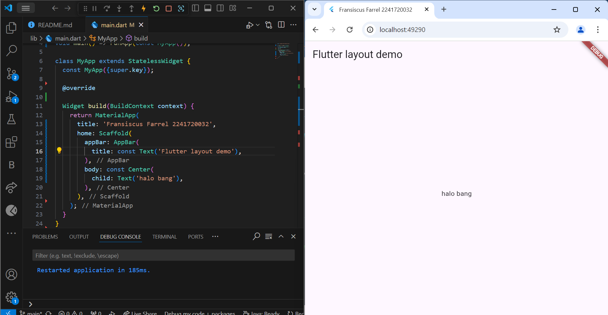
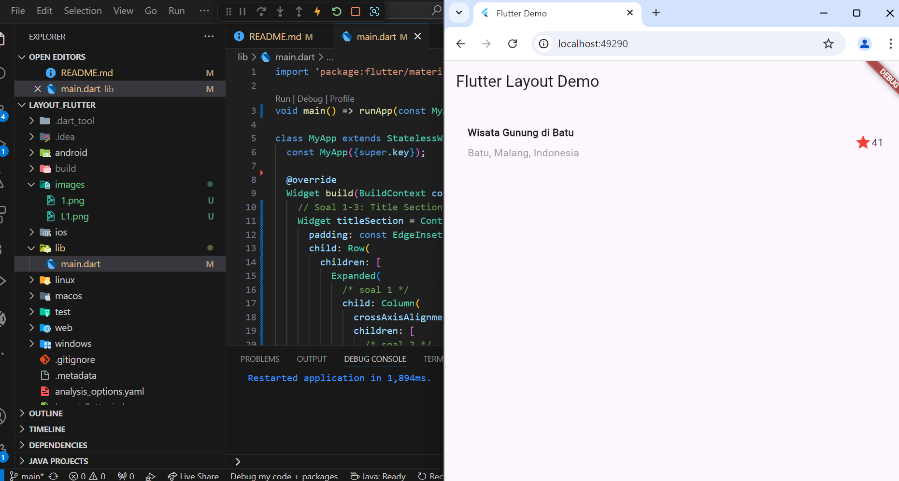

# hello im Farrel

A new Flutter Layout project.

## Praktikum 1

### langkah 1

### soal 1-3

## Praktikum 2 - 4

## Tugas 2

### soal 1

##### Untuk melakukan pengiriman data ke halaman berikutnya cukup menambahkan informasi arguments pada penggunaan Navigator. Perbarui kode pada bagian Navigator menjadi seperti berikut. Navigator.pushNamed(context, '/item', arguments: item);

